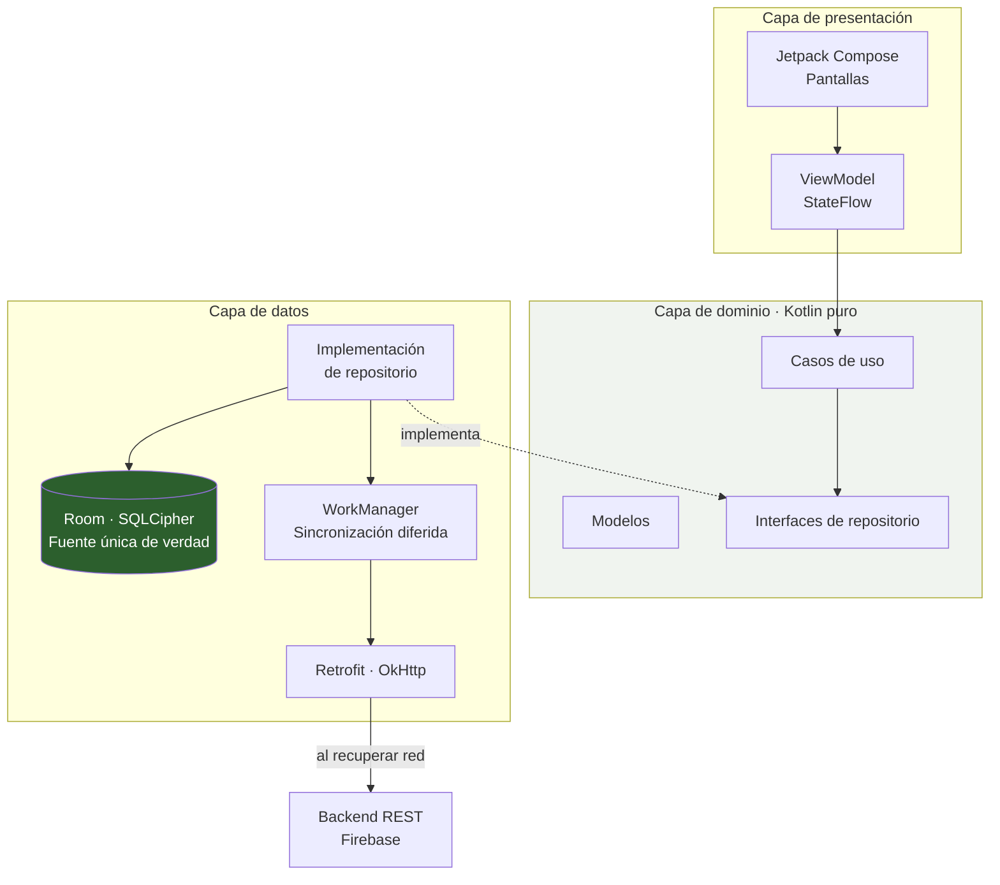
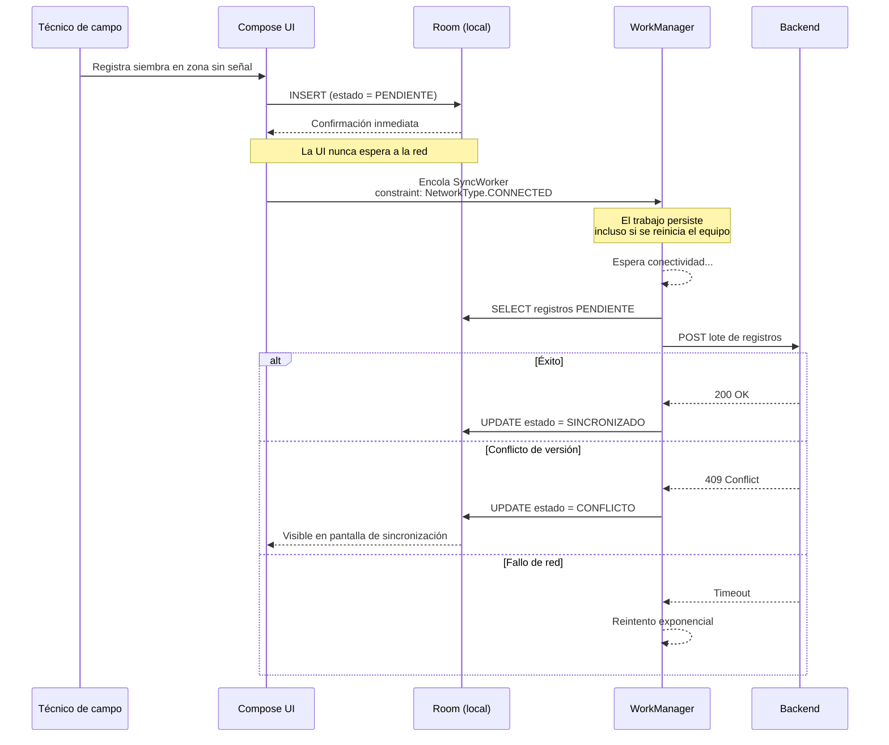
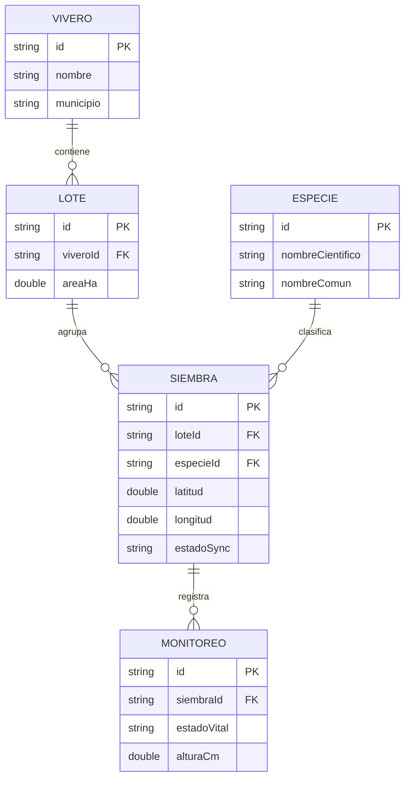

<div align="center">

# 🌱 Retoño

**Inventario forestal georreferenciado que funciona sin señal.**

Aplicación móvil nativa Android *offline-first* para el registro y seguimiento de supervivencia de siembras en viveros comunitarios de Antioquia.

[](https://developer.android.com)
[](https://kotlinlang.org)
[](https://developer.android.com/jetpack/compose)
[](docs/02-arquitectura.md)
[](LICENSE)

[Problema](#el-problema) · [Solución](#la-solución) · [Arquitectura](#arquitectura) · [Instalación](#instalación-y-despliegue) · [Documentación](#documentación) · [Presentación](presentacion/)

</div>

---

## El problema

Antioquia es el departamento de la región andina con mayor superficie deforestada del país. Los programas de restauración que responden a esa situación —entre ellos Antioquia Reverdece, con meta de 40 millones de árboles— no se ejecutan de forma centralizada, sino a través de viveros comunitarios y familias vinculadas a esquemas de Pago por Servicios Ambientales.

Restaurar no termina con la siembra. El indicador que determina si una intervención fue efectiva, y el que las entidades financiadoras exigen para verificar la ejecución, es la **tasa de supervivencia por lote y por especie**.

Ese dato nace en campo, y es justo ahí donde el proceso se rompe:

| Momento | Soporte actual | Falla |
|---|---|---|
| Captura en el lote | Papel | Deterioro por lluvia, planillas perdidas, sin coordenadas |
| Transcripción | Hoja de cálculo | Reproceso manual, errores de digitación, días de retraso |
| Consolidación | Archivos dispersos | Sin supervivencia oportuna, versiones inconsistentes |

La causa raíz es la conectividad. En Colombia la brecha digital se ha reducido, pero persiste: el uso de internet en centros poblados y rural disperso está cerca de veinte puntos por debajo de las cabeceras municipales. Y el técnico de campo no trabaja en un hogar conectado: trabaja en el lote.

## La solución

Retoño invierte la relación habitual entre aplicación y red. **La base de datos local es la única fuente de verdad**; la conectividad es un detalle de infraestructura que actúa por detrás.

- **Registro sin conexión.** Lotes, siembras individuales y monitoreos se capturan y consultan con la aplicación completamente aislada de la red. No hay estados de carga ni pantallas de error por falta de señal.
- **Trazabilidad del individuo.** Cada árbol sembrado recibe un UUID generado en el dispositivo y coordenadas GPS propias, de modo que el monitoreo de la visita 3 se vincula con certeza al mismo individuo de la visita 1.
- **Sincronización que sobrevive al reinicio.** WorkManager persiste el trabajo pendiente; al recuperar señal, los registros suben por lotes con reintento exponencial.
- **Conflictos visibles, nunca silenciosos.** Todo registro en conflicto se expone para resolución manual. En datos que sustentan verificación ante financiadores, descartar información en silencio es inaceptable.
- **Supervivencia calculada en el dispositivo.** El indicador se obtiene localmente, sin esperar al servidor.

## Arquitectura

Clean Architecture con MVVM, en tres capas con dependencias dirigidas hacia el dominio.



La capa de dominio no importa una sola clase de Android. Se prueba con JUnit puro en la JVM, sin emulador.

### Flujo de sincronización



### Modelo de datos



## Stack tecnológico

| Capa | Tecnología | Por qué |
|---|---|---|
| Lenguaje | Kotlin 2.0 | Lenguaje oficial de Android, null-safety, corrutinas |
| UI | Jetpack Compose | UI declarativa, menos código, previsualización en el IDE |
| Arquitectura | Clean + MVVM | Dominio testeable sin emulador |
| Persistencia | Room sobre SQLite | Fuente única de verdad; consultas verificadas en compilación |
| Cifrado local | SQLCipher + Android Keystore | AES-256 en reposo |
| Trabajo diferido | WorkManager | Persiste a reinicios; restricciones de red nativas |
| Red | Retrofit + OkHttp | Estándar del ecosistema; interceptores para auth |
| Inyección | Hilt | Menos acoplamiento, facilita el reemplazo por dobles de prueba |
| Backend | Cloud Firestore | Receptor de la sincronización; nivel gratuito suficiente para el pilotaje |
| Autenticación | Firebase Authentication | Sesión persistente: solo el primer acceso requiere red |
| Pruebas | JUnit, MockK, Turbine | 13 pruebas sobre la capa de dominio, sin emulador |

Las alternativas evaluadas y las razones de su descarte están documentadas en [`docs/01-formulario-entrega1.md`](docs/01-formulario-entrega1.md#41-enfoque-tecnológico-seleccionado-stack).

## Estructura del repositorio

```
retono-app/
├── app/
│   └── src/
│       ├── main/
│       │   ├── java/co/edu/ucn/retono/
│       │   │   ├── data/
│       │   │   │   ├── local/          # Room: entidades, DAO, cifrado, semilla
│       │   │   │   ├── location/       # Lectura de GPS
│       │   │   │   ├── remote/         # Retrofit: API y DTO
│       │   │   │   ├── repository/     # Implementación de repositorios
│       │   │   │   └── sync/           # WorkManager: SyncWorker
│       │   │   ├── domain/
│       │   │   │   ├── model/          # Modelos de negocio
│       │   │   │   ├── repository/     # Interfaces (contratos)
│       │   │   │   └── usecase/        # Casos de uso
│       │   │   ├── ui/
│       │   │   │   ├── navigation/     # NavHost y barra inferior
│       │   │   │   ├── screens/        # Lotes, Registro, Sincronización
│       │   │   │   ├── components/     # Componentes reutilizables
│       │   │   │   └── theme/          # Color, tipografía, tema
│       │   │   ├── MainActivity.kt
│       │   │   └── RetonoApplication.kt
│       │   │   └── di/                 # Módulos Hilt
│       │   └── res/                    # Recursos y configuración de red
│       └── test/                       # Pruebas unitarias de dominio
├── docs/
│   ├── 01-formulario-entrega1.md       # Documento maestro de la entrega
│   ├── 02-arquitectura.md              # Decisiones arquitectónicas (ADR)
│   ├── 03-manual-despliegue.md         # Guía paso a paso
│   ├── 04-evidencias.md                # Capturas y resultados de pruebas
│   ├── 05-referencias.md               # Fuentes citadas
│   └── diagramas/                      # Diagramas exportados
├── landing/
│   └── index.html                      # Landing page del proyecto
├── presentacion/
│   └── Retono-Entrega1.pptx            # Presentación ejecutiva
├── .gitignore
├── LICENSE
└── README.md
```

## Instalación y despliegue

### Requisitos

| Componente | Versión mínima |
|---|---|
| Android Studio | Ladybug 2024.2.1 |
| JDK | 17 |
| Android SDK | API 34 (compile) / API 26 (min) |
| Dispositivo o emulador | Android 8.0 (API 26) o superior |

### Clonar y compilar

```bash
git clone https://github.com/<usuario>/retono-app.git
cd retono-app
```

Abra la carpeta en Android Studio y espere la sincronización de Gradle.

> El repositorio no incluye `gradle/wrapper/gradle-wrapper.jar` porque es un binario. Android Studio lo genera al abrir el proyecto; si prefiere la línea de comandos, ejecute `gradle wrapper` una vez con Gradle 8.9 instalado.

Luego:

```bash
./gradlew assembleDebug          # Compilar variante de depuración
./gradlew installDebug           # Instalar en el dispositivo conectado
./gradlew test                   # Pruebas unitarias de dominio
./gradlew connectedAndroidTest   # Pruebas instrumentadas
```

### Configurar Firebase

El proyecto **compila con o sin credenciales**. El plugin `google-services` se aplica solo si existe `app/google-services.json`; si falta, la app corre en modo local y los registros quedan en `PENDIENTE`.

Para activar la sincronización:

1. Cree un proyecto en la [consola de Firebase](https://console.firebase.google.com).
2. Agregue una app Android con el paquete **`co.edu.ucn.retono`** (sin sufijos).
3. Descargue `google-services.json` y colóquelo en `app/`.
4. En **Authentication → Sign-in method**, habilite **Correo electrónico/contraseña**.
5. En **Firestore Database**, cree la base en modo producción.
6. En **Reglas**, pegue el contenido de [`firebase/firestore.rules`](firebase/firestore.rules) y publique.

> El `applicationId` de la variante de depuración no lleva sufijo a propósito: el plugin exige que coincida exactamente con el `package_name` del JSON.

### Variables locales

Cree `local.properties` en la raíz (excluido del control de versiones):

```properties
sdk.dir=/ruta/a/su/Android/Sdk
API_BASE_URL="https://su-backend.example.com/api/v1/"
```

### Verificar el comportamiento offline

La forma correcta de probar el núcleo del proyecto:

1. Instale la aplicación e inicie sesión con conectividad.
2. Active el modo avión.
3. Registre un lote y al menos tres siembras. La aplicación responde de inmediato.
4. Abra la pantalla de sincronización: los registros aparecen como `PENDIENTE`.
5. **Reinicie el dispositivo** con el modo avión aún activo. Los registros persisten.
6. Desactive el modo avión. WorkManager ejecuta la sincronización sin intervención y los estados pasan a `SINCRONIZADO`.

## Documentación

| Documento | Contenido |
|---|---|
| [`docs/00-primeros-pasos.md`](docs/00-primeros-pasos.md) | Guía para ejecutar la app en Android Studio desde cero |
| [`docs/01-formulario-entrega1.md`](docs/01-formulario-entrega1.md) | Documento maestro: problema, pregunta, objetivos SMART, arquitectura, costos y seguridad |
| [`docs/02-arquitectura.md`](docs/02-arquitectura.md) | Registros de decisión arquitectónica (ADR) |
| [`docs/03-manual-despliegue.md`](docs/03-manual-despliegue.md) | Guía de despliegue y publicación |
| [`docs/04-evidencias.md`](docs/04-evidencias.md) | Capturas, métricas de rendimiento y resultados SUS |
| [`docs/05-referencias.md`](docs/05-referencias.md) | Fuentes bibliográficas y de datos |

## Estado del proyecto

| Sprint | Alcance | Estado |
|---|---|---|
| Sprint 0 | Descubrimiento y prototipado | 🟢 Implementado |
| Sprint 1 | Persistencia local cifrada y registro offline | 🟢 Implementado |
| Sprint 2 | GPS validado, fotografía procesada y monitoreo de supervivencia | 🟢 Implementado |
| Sprint 3 | Sincronización con Firestore y autenticación | 🟢 Implementado |

**Qué funciona hoy:** autenticación con sesión persistente; administración de lotes con creación, edición y selección del lote activo; registro de árboles con GPS validado y fotografía reescalada sin metadatos EXIF; monitoreo de supervivencia por individuo; persistencia local cifrada; cálculo del indicador sin red; y sincronización con Firestore en orden de dependencias (lote → siembra → monitoreo) con detección de conflictos por marca temporal.

**Qué falta:** subida de las fotografías a Firebase Storage. Hoy se procesan y guardan en el almacenamiento privado del dispositivo, pero solo la ruta local viaja al servidor.

## Autor

**Yeison Alberto Gómez Amaya**
Diseño de Aplicaciones Móviles — Facultad de Ingeniería y Ciencias Ambientales
Fundación Universitaria Católica del Norte

## Licencia

Distribuido bajo licencia MIT. Consulte [`LICENSE`](LICENSE).
